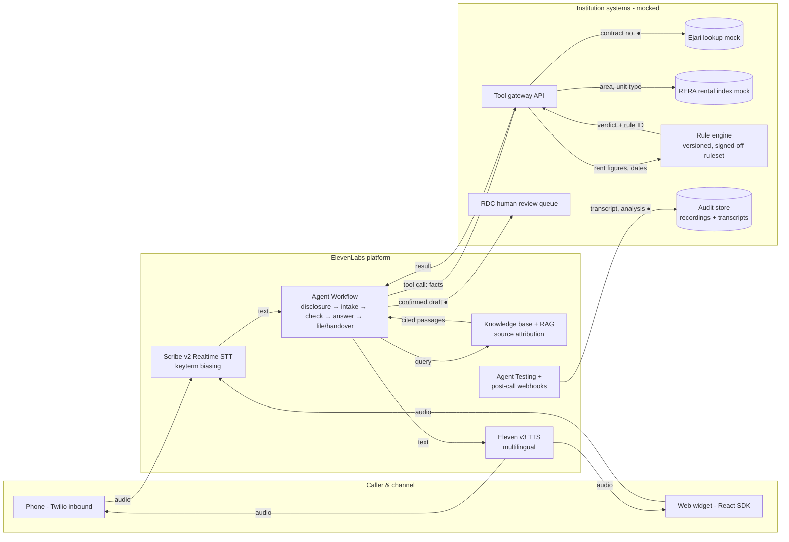

# Phone-a-friend
# Rent Rights Line — Phone-a-Friend

A multilingual voice agent that tells Dubai tenants and landlords whether a proposed **residential rent increase** is permitted under published rules, and prepares a Rental Dispute Centre (RDC) filing for human review when the caller wants to proceed.

Built for the **Ignyte × ElevenLabs Future of Voice AI Challenge** — Track 2 (Government Services), use case: *Rights Checks & Dispute Prevention*.

> **Status:** challenge prototype. Not deployed in production. All institutional systems (Ejari, RERA index, RDC queue) are mocks.

---

## 1. What it does

1. Caller phones in (or opens the web widget) and speaks in their language.
2. Agent discloses it is an AI, that it gives information and not legal advice, and that the call is recorded.
3. Agent collects the facts: Ejari contract number, area, unit type, current rent, proposed rent, date the increase notice was received.
4. A **deterministic rule engine** — not the LLM — checks the increase against the RERA rental index and the published increase caps, plus the notice-period requirement.
5. Agent reads back a plain answer with the rule and source document it used.
6. If the caller wants to file, the agent drafts the RDC filing, reads it back for confirmation, and places it in the **human review queue**. Nothing is filed without an officer's approval.

**Out of scope:** deciding disputes, interpreting contracts, commercial leases, eviction cases, any question the rule engine cannot answer from published rules (these go to a human).

---

## 2. Architecture



● = personal data crosses a boundary.

### Components and why

| Component | Why it is needed |
|---|---|
| Agents Platform | Hosts the agent, conversation config, recording. |
| Agent Workflows | Enforces the order: disclosure must happen before intake; filing node only reachable after an explicit confirmation. Per-node tool scoping means the filing tool does not exist in the answer node. |
| Scribe v2 Realtime | Keyterm biasing for Ejari, RERA, community names (JVC, Al Barsha, Deira) and Arabic legal terms. |
| Eleven v3 TTS | Natural delivery in English, Arabic and follow-on languages. |
| Knowledge base + RAG | Published rules (rent-increase decree, tenancy law notice rules, RERA guidance) so the agent can cite the document behind each answer. |
| Server tools (webhooks) | Calls to the tool gateway: Ejari lookup, index lookup, rule engine, filing draft. |
| Telephony (Twilio) | Inbound calls on test numbers. |
| Agent Testing | Multi-run pass rates, tool-call tests on the rule engine and filing actions. |
| Post-call webhooks | Push transcript and analysis to the audit store. |

---

## 3. The rule engine

The central design decision: **the LLM never decides whether an increase is legal.** It gathers facts and speaks the result; a deterministic function computes it.

- Input: current rent, proposed rent, index average for the area and unit type, notice date, contract expiry date.
- Output: `permitted | not_permitted | cannot_determine`, the maximum allowed increase, the rule ID, and the source document.
- The ruleset is a versioned JSON file. A qualified legal reviewer must sign off each version before it is loaded — the sign-off applies to the logic, not just individual filings.
- Any input the engine cannot handle (missing index data, disputed dates, non-residential property) returns `cannot_determine`, which routes to a human.

Rules encoded in v1 (to be confirmed by the legal reviewer before launch):

| Current rent vs. index average | Maximum increase |
|---|---|
| Up to 10% below | No increase |
| 11–20% below | 5% |
| 21–30% below | 10% |
| 31–40% below | 15% |
| More than 40% below | 20% |

Plus: changes to tenancy terms require written notice at least 90 days before contract expiry.

---

## 4. Guardrails

| Requirement | How the design enforces it |
|---|---|
| Opening disclosure | First workflow node is fixed text; no transition to intake until it has played. |
| Information, not advice | Answers are templated from the rule engine output; the prompt blocks opinions on outcomes. |
| Verification without secrets | Ejari number + OTP to the registered mobile, only for filing. No passwords, no Emirates ID numbers spoken. |
| Human approval point | Filing tool only creates a draft in the RDC review queue; an officer approves every filing. |
| Opt-out | "Stop" or "human" at any node ends the flow or transfers. |
| Escalation trigger | `cannot_determine`, distress, threats of eviction, or legal questions → handover with the case summary attached. |

---

## 5. Languages

- **Launch:** English and Arabic (including Gulf dialect handling via Scribe v2).
- **Route to others:** Hindi, Urdu, Malayalam, Tagalog — detected on the first utterance; voice and prompt switch via language presets. Rule engine output is language-independent, so only the answer templates need translation and review.

---

## 6. Failure handling

| Dependency down | Behaviour |
|---|---|
| Ejari mock | Proceed with caller-stated figures; answer is caveated as "based on what you told me". |
| RERA index mock | No verdict. Agent explains and offers a human callback. |
| Rule engine | No verdict under any circumstance; handover. |
| Review queue | Draft held in audit store; caller told filing is not yet submitted. |
| LLM | LLM cascading to a fallback model; workflow structure unchanged. |

---

## 7. Repository layout

```
/agent          ElevenLabs agent config, workflow export, prompts per node
/knowledge      Published rule documents loaded into the knowledge base
/gateway        Tool gateway API (webhook endpoints)
/rule_engine    Deterministic checker + versioned ruleset + unit tests
/mocks          Ejari, RERA index and RDC queue mocks
/tests          Agent Testing scenarios and tool-call tests
/docs           Architecture diagram, guardrail table
```

## 8. Running locally

```bash
# 1. Tool gateway + mocks
cd gateway
pip install -r requirements.txt
uvicorn main:app --port 8000

# 2. Expose to ElevenLabs
ngrok http 8000   # paste the URL into the agent's server tool config

# 3. Rule engine tests
cd ../rule_engine && pytest
```

Environment variables: `ELEVENLABS_API_KEY`, `TWILIO_ACCOUNT_SID`, `TWILIO_AUTH_TOKEN`, `GATEWAY_BASE_URL`.

## 9. Evaluation

- Rule engine: unit tests on every band boundary (10/11%, 20/21% …) and notice-period edge cases.
- Agent Testing: 20+ scenarios × multiple runs, reporting pass rate; tool-call tests confirm the filing tool is only invoked after explicit confirmation.
- Simulated conversations in English and Arabic, including one escalation path.
- Post-call analysis criteria: disclosure given, source cited, no advice given, correct verdict.

## 10. Team

**Phone-a-Friend** — see Idea Canvas box P.
